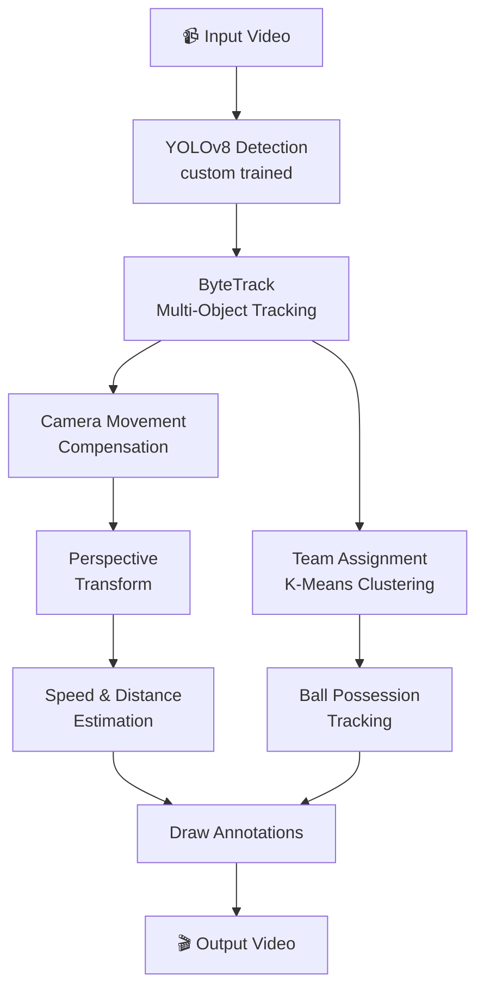

<div align="center">


# ⚽ PitchVision AI

### *Advanced Football Match Analysis using Computer Vision & Deep Learning*

[Features](#-features) • [Demo](#-demo) • [Architecture](#-architecture) • [Installation](#-installation) • [Usage](#-usage) • [Modules](#-modules)

---

</div>

## 📌 Overview

**PitchVision AI** is a fully automated football match analysis system that uses a custom-trained **YOLOv8** model and **ByteTrack** multi-object tracking to extract rich tactical and physical insights from raw match footage.

It detects and tracks every **player**, **goalkeeper**, **referee**, and the **ball** across an entire match video — then overlays real-time analytics directly onto the output video, including:

- 🎯 Player tracking with persistent IDs
- 👕 Automatic team identification via jersey color clustering
- ⚡ Speed & distance metrics per player
- 🏈 Ball possession tracking per team
- 📷 Camera movement compensation
- 🗺️ Perspective-transformed real-world coordinates

---

## 🎬 Demo

> **Input** → Raw match broadcast footage  
> **Output** → Fully annotated analysis video

| Annotation | Description |
|---|---|
| 🟢 Green triangle | Ball position |
| 🔴 Red triangle | Player with ball possession |
| 🟡 Yellow ellipse | Referee |
| 🔵🟣 Colored ellipses | Players colored by team |
| `#ID` | Persistent player tracking ID |
| `km/h` & `m` | Real-time speed & distance |
| Top-left box | Camera movement (X & Y) |
| Bottom-right box | Team ball control percentages |

---

## ✨ Features

### 🧠 Custom YOLOv8 Model
- Trained specifically on football footage to detect **4 classes**: `ball`, `goalkeeper`, `player`, `referee`
- Far superior to generic COCO models — no misclassifying goalkeepers as random objects
- Trained on a curated football dataset with 750+ annotated frames

### 🎯 ByteTrack Multi-Object Tracking
- Assigns **persistent IDs** to each player across all frames
- Maintains identity even through occlusions and collisions
- Goalkeepers are merged into the player class for tracking consistency

### 👕 Automatic Team Assignment (K-Means Clustering)
- Crops each player's bounding box and samples their **jersey color** from the top half
- Runs **K-Means clustering** (k=2) to separate the two teams automatically
- No manual labeling — fully unsupervised from jersey colors alone

### 📐 Perspective Transform (Real-World Coordinates)
- Applies `cv2.getPerspectiveTransform` to map pixel positions onto **real-world pitch dimensions** (68m × 23.32m)
- Allows physically accurate speed and distance measurements

### ⚡ Speed & Distance Estimation
- Calculates distance traveled using transformed real-world positions
- Computes speed in **km/h** using a 5-frame sliding window
- Overlaid directly on each player in the output video

### 📷 Camera Movement Compensation
- Uses **Lucas-Kanade Optical Flow** to detect and measure camera panning
- Adjusts all player positions to compensate for camera motion
- Ensures speed/distance measurements reflect actual player movement, not camera drift

### 🏈 Ball Possession Analysis
- Assigns ball possession to the nearest player (within a 70px threshold)
- Tracks **cumulative possession percentage** per team throughout the match
- Displayed as a real-time overlay in the output video

### 🔄 Stub Caching
- Saves YOLO tracking and camera movement results to `.pkl` stub files
- Subsequent runs skip expensive inference and load from cache instantly
- Massive time savings when tweaking downstream analysis

---

## 🏗️ Architecture

```
PitchVision-AI/
│
├── main.py                          # 🚀 Entry point — orchestrates the full pipeline
│
├── trackers/
│   └── tracker.py                   # YOLOv8 inference + ByteTrack + annotation drawing
│
├── team_assigner/
│   └── team_assigner.py             # K-Means jersey color clustering for team ID
│
├── player_ball_assigner/
│   └── player_ball_assigner.py      # Nearest-player ball possession assignment
│
├── camera_movement_estimator/
│   └── camera_movement_estimator.py # Lucas-Kanade optical flow camera compensation
│
├── view_transformer/
│   └── view_transformer.py          # Perspective transform to real-world coordinates
│
├── speed_and_distance_estimator/
│   └── speed_and_distance_estimator.py # Speed (km/h) & distance (m) per player
│
├── utils/
│   ├── video_utils.py               # read_video / save_video helpers
│   └── bbox_utils.py                # Bounding box utility functions
│
├── training/
│   ├── train.py                     # YOLOv8 training script
│   ├── yolo_inference.py            # Quick inference test
│   └── runs/detect/train-3/
│       └── weights/
│           ├── best.pt              # ⭐ Best custom-trained model weights
│           └── last.pt              # Last epoch model weights
│
├── stubs/                           # Cached inference results (.pkl)
├── input/                           # Input match video
├── output_videos/                   # Generated annotated output video
└── yolov8x.pt                       # Base YOLOv8x pretrained weights
```

---

## 🔄 Pipeline



---

## 🛠️ Installation

### Prerequisites
- Python 3.8+
- pip
- Git LFS (for cloning large model files)

### 1. Clone the Repository

```bash
# Install Git LFS first (required for model weights & videos)
git lfs install

# Clone the repo
git clone https://github.com/NAMEER97/PitchVision-AI.git
cd PitchVision-AI
```

### 2. Install Dependencies

```bash
pip install ultralytics supervision scikit-learn pandas numpy opencv-python
```

### 3. Verify Model Weights

Make sure the custom trained weights are present:
```
training/runs/detect/train-3/weights/best.pt
```

---

## 🚀 Usage

### Run the Full Analysis Pipeline

```bash
python main.py
```

This will:
1. Read the input video from `input/08fd33_4.mp4`
2. Run YOLOv8 detection on all frames (or load from stub cache)
3. Track all players, referees, and ball using ByteTrack
4. Compensate for camera movement
5. Transform positions to real-world coordinates
6. Calculate speed and distance for each player
7. Assign team colors and ball possession
8. Render and save the annotated video to `output_videos/output_video.mp4`

### Quick Inference Test

```bash
python yolo_inference.py
```

---

## 📦 Modules

### `trackers/tracker.py`
The core detection and tracking engine.

| Method | Description |
|---|---|
| `detect_frames()` | Batched YOLOv8 inference (batch size 20) |
| `get_object_tracks()` | Full tracking pipeline with stub caching |
| `add_position_to_tracks()` | Appends foot/center positions to track data |
| `interpolate_ball_positions()` | Fills missing ball positions via interpolation |
| `draw_annotations()` | Renders ellipses, triangles, IDs, and stats |

### `team_assigner/team_assigner.py`
Unsupervised team color detection.

| Method | Description |
|---|---|
| `get_player_color()` | Crops player bbox, runs K-Means on top half |
| `assign_team_color()` | Fits global K-Means (k=2) across all players |
| `get_player_team()` | Predicts team for a given player, with caching |

### `camera_movement_estimator/camera_movement_estimator.py`
Optical flow-based camera stabilization.

| Method | Description |
|---|---|
| `get_camera_movement()` | Lucas-Kanade optical flow per frame |
| `add_adjust_positions_to_tracks()` | Subtracts camera delta from all positions |
| `draw_camera_movement()` | Overlays camera X/Y movement on frames |

### `view_transformer/view_transformer.py`
Converts pixel coordinates to real-world meters.

| Method | Description |
|---|---|
| `transform_point()` | Applies perspective warp to a single point |
| `add_transformed_position_to_tracks()` | Bulk-transforms all track positions |

### `speed_and_distance_estimator/speed_and_distance_estimator.py`
Physical metrics computation.

| Method | Description |
|---|---|
| `add_speed_and_distance_to_tracks()` | 5-frame window speed/distance calculation |
| `draw_speed_and_distance()` | Renders km/h & meters under each player |

### `player_ball_assigner/player_ball_assigner.py`
Ball possession logic.

| Method | Description |
|---|---|
| `assign_ball_to_player()` | Finds nearest player to ball (max 70px) |

---

## 🧪 Training

The custom YOLOv8 model was trained on a football-specific dataset:

```bash
cd training
python train.py
```

**Training config:**
- Base model: `yolov8m.pt`
- Dataset: `football-players-detection-1` (custom annotated)
- Classes: `ball`, `goalkeeper`, `player`, `referee`
- Epochs: ~100+
- Results: See `training/runs/detect/train-3/`

---

## 📊 Training Results

Training results and performance curves are available in:
```
training/runs/detect/train-3/
├── results.png              # Loss & mAP curves
├── confusion_matrix.png     # Class confusion matrix
├── BoxPR_curve.png          # Precision-Recall curve
└── val_batch*.jpg           # Validation predictions
```

---

## 📋 Requirements

```
ultralytics
supervision
scikit-learn
pandas
numpy
opencv-python
```

---

## 👤 Author

**Nameer**  
GitHub: [@NAMEER97](https://github.com/NAMEER97)

---

## ⭐ Star this repo if you found it useful!

</CodeContent>
<parameter name="Description">Creating a comprehensive, beautifully formatted README.md for the PitchVision-AI project.
